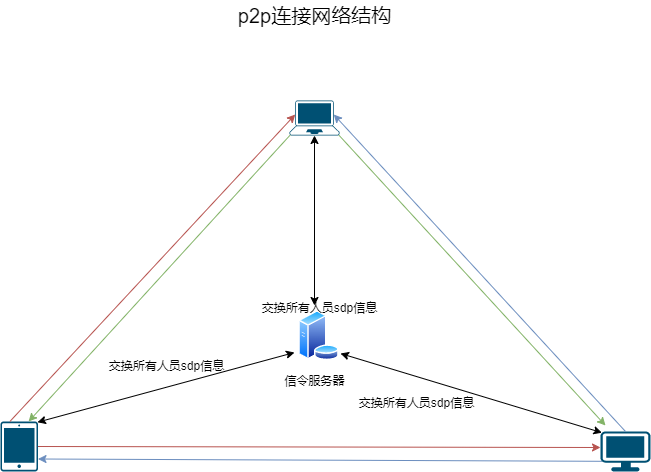
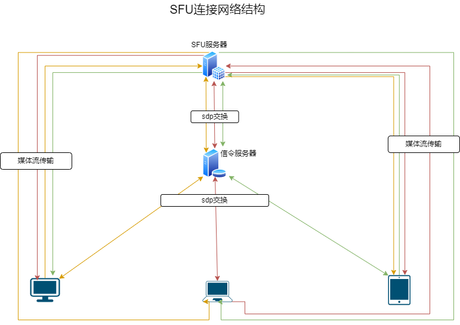

# 简单的SFU服务封装,基于pion/webrtc

## webrtc传统p2p和sfu连接的网络结构区别

## 媒体流收发量计算

* p2p: 设备媒体流数量
    - 2人通信: 单设备2路(上1 下1),共2 * 2 = 4路
    - 3人通信: 单设备4路(上2 下2),共3 * 4 = 12路
    - 4人通信: 单设备6路(上3 下3),共4 * 6 = 24路

* sfu: 设备媒体流数量
    - 2人通信: 单设备2路(上1 下1),网络内共2 * 2 = 4路,由服务器维护上载2路,下载2路,共4路
    - 3人通信: 单设备3路(上1 下2),网络内共3 * 3 = 9路,由服务器维护上载3路,下载6路,共4路
    - 4人通信: 单设备4路(上1 下3),网络内共4 * 4 = 16路,由服务器维护上载4路,下载12路,共16路
* mcu: 这里不概述

### 总结
> p2p模式下,客户端网络结构随着连通设备数量成指数倍增长,因终端设备特殊,故3人以上极易导致卡顿.

> sfu模式下,客户端媒体流数量 = 网络中的所有媒体终端数量,有效降低终端负载和网络压力,在2人以上的场景下,相对于p2p模式优势明显,但对服务器网络要求相对较高.